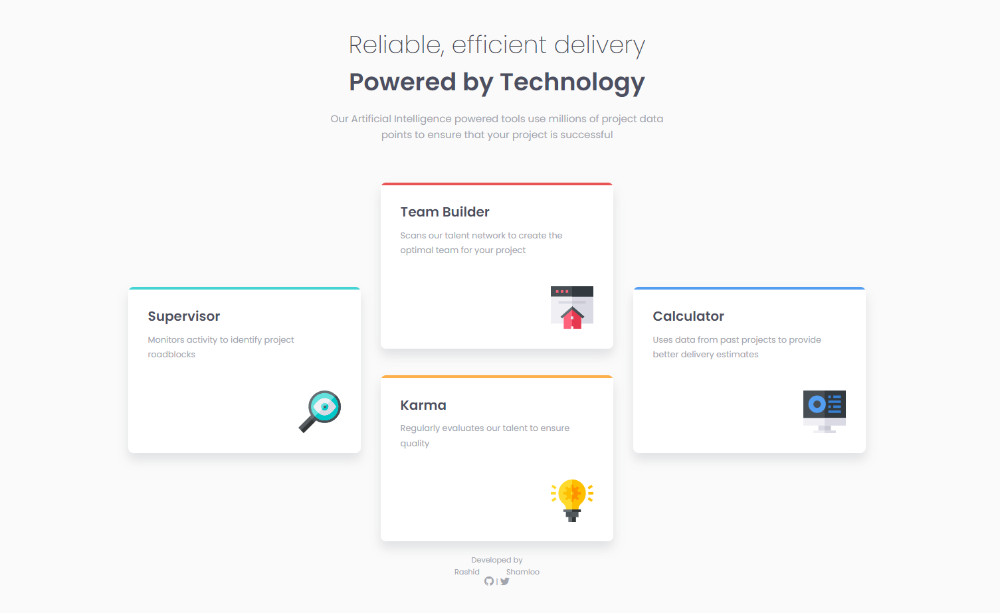
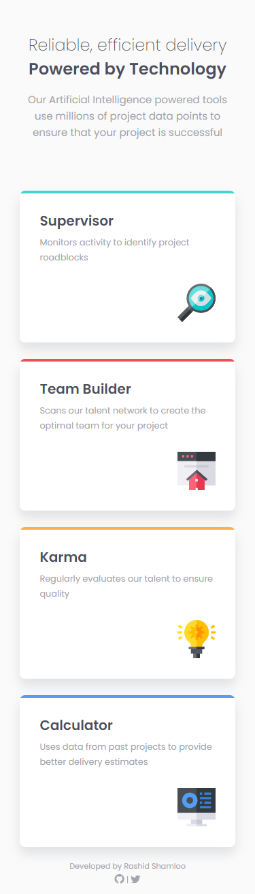

# Front End Mentor - Project 009 - Four Card Feature Section

This is a solution to the [Four Card Feature Section challenge on Frontend Mentor](https://www.frontendmentor.io/challenges/four-card-feature-section-weK1eFYK).

## Table of contents

- [Overview](#overview)
  - [Screenshot](#screenshot)
  - [Links](#links)
- [My process](#my-process)
  - [Built with](#built-with)
  - [What I learned](#what-i-learned)
- [Author](#author)

## Overview

### Screenshot

- Desktop

- Mobile

### Links

- Solution URL: https://github.com/rashidshamloo/fem_009_four-card-feature-section/
- Live Site URL: https://rashidshamloo.github.io/fem_009_four-card-feature-section/

## My process

### Built with

- Semantic HTML5 markup
- Sass
- Flexbox

### What I learned

- More Flexbox!
- Positioning elements in CSS with "position:absolute;"

## Author

- Frontend Mentor - [@rashidshamloo](https://www.frontendmentor.io/profile/rashidshamloo)
- Twitter - [@rashidshamloo](https://www.twitter.com/rashidshamloo)
